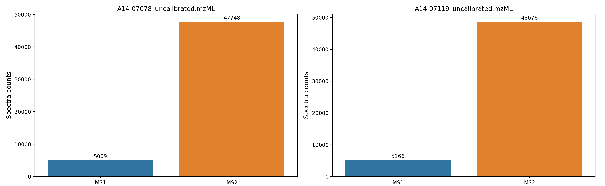
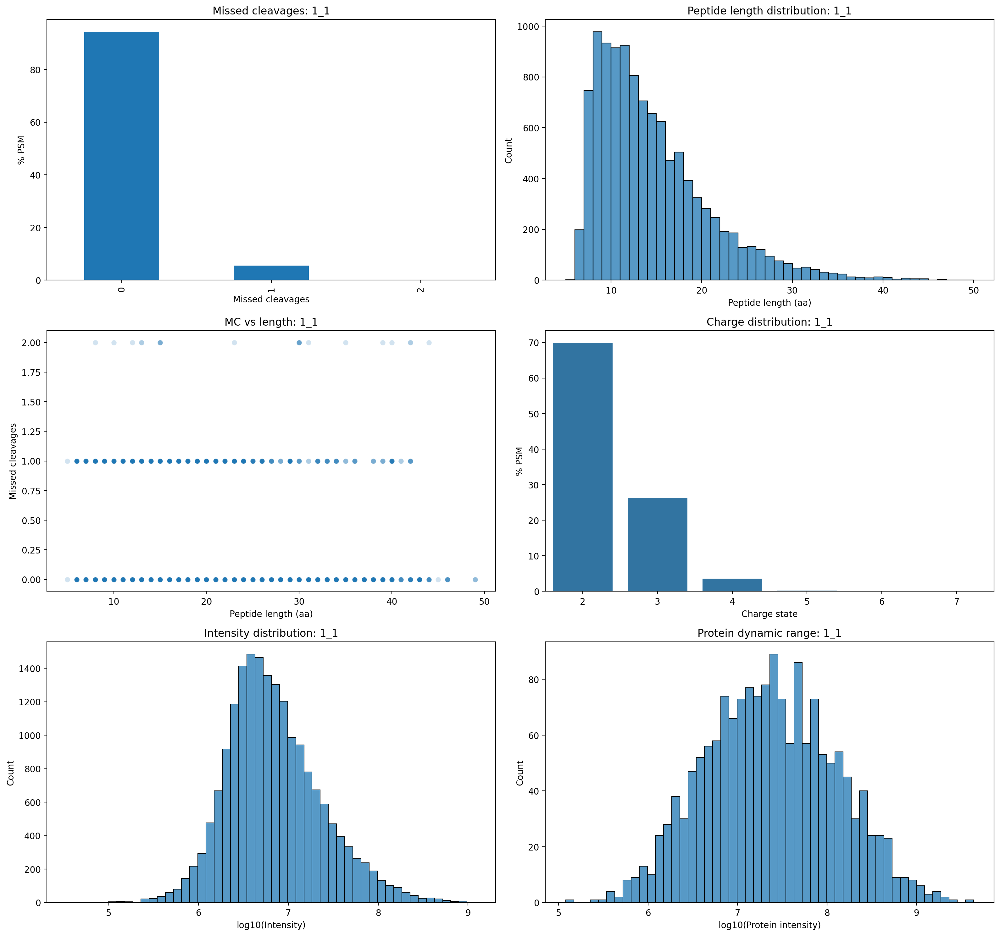
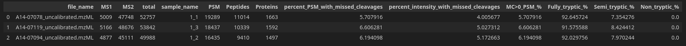

  
# ms-qc-notebook

Jupyter notebook for quality control of mass spectrometry data.

This notebook performs basic QC for proteomics experiments processed with FragPipe and raw data in mzML format.

## What this notebook does
From raw mzML files:
- counts MS1 and MS2 spectra

From FragPipe results
- PSM / peptide / protein counts
- fraction of PSMs with missed cleavages
- fraction of signal intensity from missed cleavages
- enzymatic specificity (fully / semi / non-tryptic peptides)
- missed cleavage distribution
- peptide length distribution
- charge state distribution
- intensity distribution (PSM level)
- protein dynamic range

All results are visualized and summarized in a final merged table.
## Dependencies 
- Python>=3.12
- matplotlib
- pandas
- pyteomics
- seaborn
- numpy
## Input data structure (FragPipe v23.1 automatically generated)
The notebook expects the following structure:
```
project/
├── raw/                       # mzML files
│   ├── sample1.mzML
│   ├── sample2.mzML
│   └── ...
│
├── results/                   # FragPipe output
│   ├── experiment_annotation.tsv
|   ├── ... 
│   ├── sample1/
│   │   ├── psm.tsv
│   │   ├── peptide.tsv
|   |   ├── protein.tsv
|   |   └── ...
│   ├── sample2/
│   │   ├── psm.tsv
│   │   ├── peptide.tsv
|   |   ├── protein.tsv
|   |   └── ...
│   └── ...
```
`experiment_annotation.tsv` must contain at least two columns: `file` - raw file name; `sample_name` - sample number in FragPipe
## Run
Install dependencies:
```
$ pip install -r requirements.txt
```
At the top of the notebook set:
```python
result_path = ''   # path to folder with FragPipe results
raw_dir_path = ''  # path to folder with mzML files
annotation_path = f'{result_path}/experiment_annotation.tsv'
```

Run all cells

## Output
### MS1/MS2 counting

### Trypsinolysis QC

### Summary table


## Test data
Public raw data used for testing were obtained from the PRIDE repository (project PXD000498).
